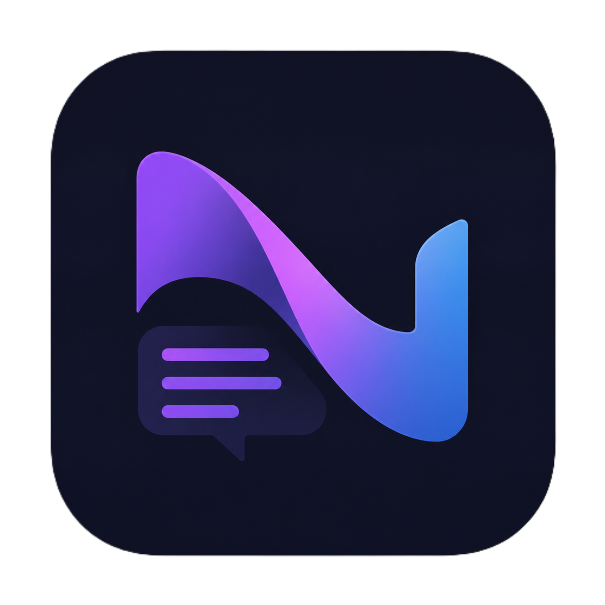
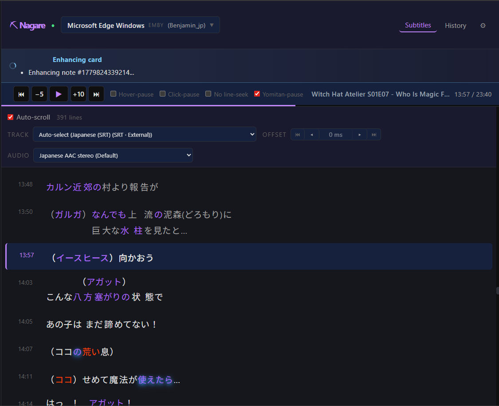
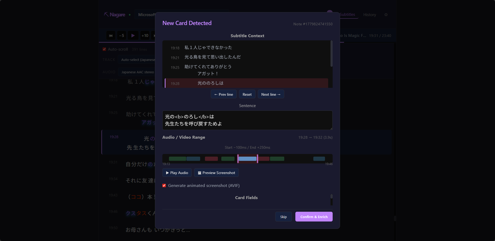

<p align="center">
    
</p>

<h1 align="center">Nagare (流れ)</h1>

<p align="center">
    <em>Pronounced "Nah-gah-reh" — subtitle mining companion for Emby, Jellyfin, and Plex.</em>
</p>

<div align="center">

[](https://github.com/bpwhelan/Nagare/releases)
<a href="https://github.com/sponsors/bpwhelan">
    
</a>
[](https://ko-fi.com/beangate)
[](https://github.com/bpwhelan/Nagare/pkgs/container/nagare)
[](https://github.com/bpwhelan/Nagare?tab=MIT-1-ov-file)

</div>

### 🎬 See it in Action



<p align="center"><em>The subtitle timeline — mine any line from the current or past session directly in the browser. Highlighting via https://jiten.moe/reader</em></p>

---



<p align="center"><em>Anki Enhancement Dialogue allowing for tight control over what we mine</em></p>

---


https://github.com/user-attachments/assets/3b0fb77d-189e-4558-8479-7bccaa67e86f


<p align="center"><em>Finished Card (Kiku Notetype)</em></p>

---

## What does it do?

Nagare watches your active media server playback sessions, displays a live subtitle timeline in the browser, and enriches Anki cards with sentence audio, screenshots, and source metadata — without interrupting your immersion.

> **Note:** This project is my most vibe-coded yet, so YMMV. It's really a problem that I sought out to solve for myself, but I believe/hope it can be useful for others.

---

## Features

- Live subtitle timeline synced to playback
- Sentence audio extraction and animated AVIF screenshot clips
- AnkiConnect integration with automatic card matching
- Playback controls (seek, pause, resume) from the browser.
- Yomitan-aware pause behavior. (Must turn off Secure Popup in Yomitan) 
- Watch history for mining after playback ends
- Multi-server support (Emby + Jellyfin + Plex simultaneously)
- Manual-review or automatic daily Tadoku listening-log sync, grouped by show with duplicate protection


## Roadmap

- [x] Initial prototype with Emby support
- [x] Add Jellyfin support
- [x] Add Plex support
- [x] AnkiConnect integration
- [x] Support for subtitles even when player has none (listening practice while maintaining mineability).
- [x] Mining History, allowing you to touch up cards after the fact, or add more context.
- [x] Session History, allowing you to load past sessions and mine from them.
- [x] Manual Subtitle Offset
- [ ] Automatic Subtitle Sync? IDK if this is even feasible, the ability to press a button, Nagare syncs with alass or subplz, and then sends the updated sub to the media server would be the idea.
- [ ] More Active Subtitle Sync? If you change subtitle timing in media player, Nagare will not adjust. I doubt this is possible...
- [ ] More options for audio/ss formats


## Installation

### Docker (recommended)

1. Run with Docker Compose:

```yaml
# docker-compose.yml
services:
  nagare:
    image: ghcr.io/bpwhelan/nagare:latest
    container_name: nagare
    ports:
      - "9470:9470"
    volumes:
      - ./data:/app/data
      # Optional: mount media library for disk-mode access
      # - /path/to/anime:/media/Anime:ro
    extra_hosts:
      - "host.docker.internal:host-gateway"
    restart: unless-stopped
```

```sh
docker compose up -d
```

2. Open `http://localhost:9470` and configure Nagare from the web UI Config page.

### Binary release

Download the latest binary for your platform from [GitHub Releases](https://github.com/bpwhelan/Nagare/releases).

Requirements:
- `ffmpeg` on `PATH`
- Anki with [AnkiConnect](https://ankiweb.net/shared/info/2055492159)

```sh
./nagare
```

The web UI is served at `http://localhost:9470`.

### Build from source

```sh
cd frontend && npm ci && npm run build && cd ..
cargo build --release
```

## Configuration

All configuration is managed through the web UI Config page and stored in `data/nagare.sqlite`. On first run, configure:

1. **Media server** — URL and API key (Emby/Jellyfin) or token (Plex)
2. **AnkiConnect** — URL and field mappings (`Sentence`, `SentenceAudio`, `Picture`)
3. **Media access** — `auto`, `disk`, or `api` mode; add path mappings if server and Nagare see different file paths
4. **Tadoku (optional)** — save your Tadoku username and password, then choose manual review or automatic daily sync. Nagare signs in and refreshes the browser session automatically. Manual review lets you approve or permanently decline individual ready episodes; automatic sync defaults to 8 PM Eastern. When the review workflow is first enabled, episodes completed after the previous successful sync are queued.

## How it works

1. Nagare polls your media server(s) for active playback sessions
2. Select a session or allow Nagare to auto-select the most recently active one
3. Create a card in Anki — Nagare matches it to the exact subtitle context
4. Confirm the match, preview audio/screenshot, and enrich the card

## Project structure

```
src/            Rust backend (Axum + Tokio)
frontend/       Svelte frontend (Vite)
Dockerfile      Multi-stage container build
```

Data is stored in `data/nagare.sqlite`. Generated Anki media files are prefixed with `nagare_`.
